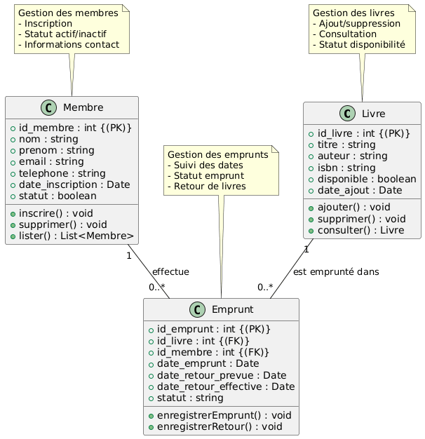

# 📚 Java EE Library & Loan Management System (Gestion de Bibliothèque)

[](https://www.oracle.com/java/)
[](https://www.mysql.com/)
[](https://tomcat.apache.org/)
[](#)
[](LICENSE)

*Bilingual README: [Français](#-version-française) | [English](#-english-version)*



---

## 🇫🇷 Version Française

### 🎯 Objectif
Le projet **JEE Library Management System** est une application web d'entreprise conçue pour informatiser et moderniser l'exploitation d'une bibliothèque municipale ou universitaire. Il répond aux défis de gestion quotidienne en automatisant l'inventaire des ouvrages, le registre des adhérents, la traçabilité en temps réel des flux d'emprunts et la détection instantanée des retards de restitution.

### 🛠️ Stack Technologique
- **Technologies Java EE & Web** : Java EE (Jakarta EE), Java Servlets, JSP (JavaServer Pages), JSTL, Expression Language (EL).
- **Architecture Logicielle** : Patron MVC (Modèle - Vue - Contrôleur) et patron DAO (*Data Access Object*) pour un découplage net entre logique métier et persistance.
- **Base de Données & Persistance** : MySQL 8, JDBC (`java.sql`), requêtes préparées (`PreparedStatement`), gestion des transactions et contraintes d'intégrité référentielle.
- **Frontend** : HTML5, CSS3, JavaScript Vanilla, Bootstrap pour une mise en page claire et responsive.
- **Serveur d'Application & IDE** : Apache Tomcat 9/10, Eclipse IDE for Enterprise Java.

### 👩‍💻 Mon Rôle & Contributions
- **Conception & Modélisation UML (`class-diagram.png`)** :
  - Conception du schéma relationnel de la base de données (`base de donnee.sql`) intégrant `Membre`, `Livre`, et `Emprunt`.
  - Élaboration du diagramme de classes décrivant les relations entités-DAO-Servlets.
- **Développement de la Couche DAO & Persistance** :
  - Implémentation des classes DAO (`LivreDAO`, `MembreDAO`, `EmpruntDAO`) gérant l'ensemble des opérations CRUD sécurisées contre les injections SQL.
  - Gestion automatique des transitions d'état : basculement de la disponibilité d'un livre (`disponible: true/false`) dès validation d'un emprunt ou d'un retour.
- **Développement des Contrôleurs Servlets & Vues JSP** :
  - Routage des requêtes HTTP (GET/POST) via des Servlets dédiées avec validation des formulaires.
  - Conception de pages JSP modulaires affichant les alertes de retard, les statistiques d'emprunt et les fiches membres.

### 📊 Résultats & Métriques Clés
- **Automatisation complète du cycle d'emprunt** : Élimination du suivi manuel sur papier ou tableur avec mise à jour instantanée des stocks.
- **Suivi des retards en temps réel** : Statuts d'emprunt dynamiques (`en cours`, `retourné`, `en retard`) pour relancer efficacement les membres.
- **Architecture robuste et maintenable** : Séparation stricte MVC facilitant toute évolution future (passage à Spring Boot ou ajout d'APIs REST).

---

## 🇬🇧 English Version

### 🎯 Objective
The **JEE Library Management System** is an enterprise Java web application engineered to digitize library operations, book inventory tracking, and subscriber loan workflows. It resolves administrative bottlenecks by centralizing member registrations, book catalog availability, automated loan lifecycle tracking, and overdue penalty monitoring.

### 🛠️ Tech Stack
- **Java EE Core**: Java Servlets, JavaServer Pages (JSP), JSTL, Expression Language.
- **Design Patterns**: Model-View-Controller (MVC) architecture coupled with the Data Access Object (DAO) pattern.
- **Database & Persistence**: MySQL 8, JDBC driver, SQL transactions, parameterized queries preventing SQL injections.
- **Frontend**: HTML5, CSS3, JavaScript, Bootstrap for responsive tables and administrative dashboards.
- **Runtime Environment**: Apache Tomcat Server, Eclipse Enterprise IDE.

### 👩‍💻 My Role & Key Contributions
- **Database Modeling & UML Specification (`class-diagram.png`)**:
  - Authored the normalized relational schema (`base de donnee.sql`) with cascade constraints across `Membre`, `Livre`, and `Emprunt`.
  - Designed the comprehensive UML class diagram structuring DAO and controller interactions.
- **DAO & Persistence Layer Implementation**:
  - Coded full CRUD operations across domain DAOs using secure JDBC `PreparedStatement`.
  - Implemented transactional logic to atomically toggle book availability upon borrowing and returning.
- **Web Layer & Servlets**:
  - Built controller Servlets dispatching requests, handling form validations, and routing to JSP views.
  - Crafted dynamic JSP views with real-time status badges for active loans and overdue borrowings.

### 📊 Key Results & Impact
- **End-to-End Loan Lifecycle Automation**: Seamless transitions between book checkout, return confirmation, and catalog status synchronization.
- **Live Overdue Tracking**: Real-time status flags (`en cours`, `retourné`, `en retard`) providing immediate visibility on overdue loans.
- **Clean Enterprise Codebase**: Fully modular MVC code structure adhering to solid enterprise Java guidelines.

---

### 🚀 Quick Start / Guide de Démarrage

#### 1. Configuration de la Base de Données
Exécutez le script SQL fourni pour initialiser la base MySQL :
```bash
mysql -u root -p < "base de donnee.sql"
```

#### 2. Déploiement sur Apache Tomcat
1. Importez le projet `GestionBibliotheque1` dans Eclipse IDE (ou IntelliJ IDEA Ultimate).
2. Configurez les identifiants de connexion MySQL dans votre classe de connexion JDBC (`DBConnection` / `config`).
3. Associez le projet à votre serveur **Apache Tomcat** (v9 ou v10).
4. Lancez le serveur et accédez à : `http://localhost:8080/GestionBibliotheque1`.
